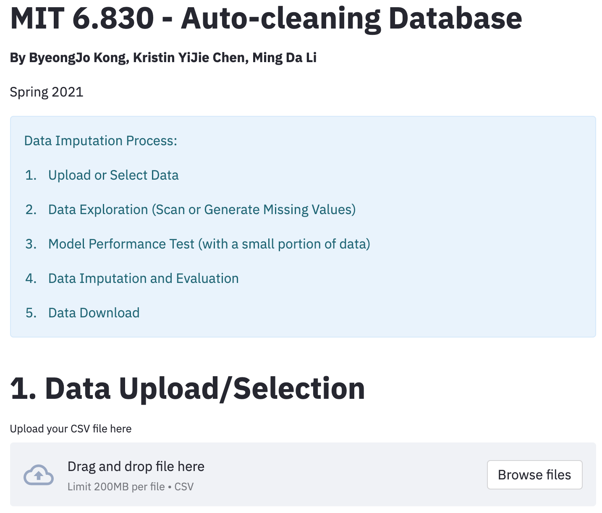

# 6.830 Final Project - Spring 2021
## Automated Data Cleaning System

### Team members:
* ByeongJo Kong, kongb@mit.edu
* Kristin Yijie Chen, kristiny@mit.edu
* Tim Ming Da Li, mingdali@mit.edu


### Project Goal
This project is to build a system that, with the input of the user’s dataset, automatically imputes missing values incolumns using machine learning models. The project emphasizes on providing the user with a holistic set of imputation capabilities by also incorporating best imputation model selection, multiplecolumn imputation, and missing values summary. In addition, this project emphasizes on usability through enabling the userwith a single-point interface.

### ML Algorithms:
* Linear Regression
* Logistic Regression
* Random Forest


### Important Files:
* demo.py : holds the necessary functions for imputing the missing data
  * impute_missing_values(), add_missing_values(), return_appropriate_model_and_metric(), encode(), etc.
* ui/ app.py : an execution file for launching the user interface. It uses the functions defined in the utils.py file
* ui/ utils.py : a modified version of demo.py to make it suitable to interact with the user interface (app.py)


### Execution

First, make sure you have 'streamlit' installed in your machine.
```bash
pip install streamlit 
```
Then, go to the folder 'ui', run the command line below.
```bash
streamlit run app.py 
```

### Important libraries
```bash
import pandas as pd
import numpy as np
import random
from sklearn.preprocessing import LabelEncoder
import itertools
from sklearn.ensemble import RandomForestClassifier
from sklearn.ensemble import RandomForestRegressor
from sklearn.linear_model import LinearRegression, LogisticRegression
from sklearn.metrics import accuracy_score
from sklearn.metrics import r2_score
from sklearn.model_selection import KFold, GridSearchCV
import timeit
import csv
import matplotlib.pyplot as plt
import streamlit as st
```

### Screenshot of demo


